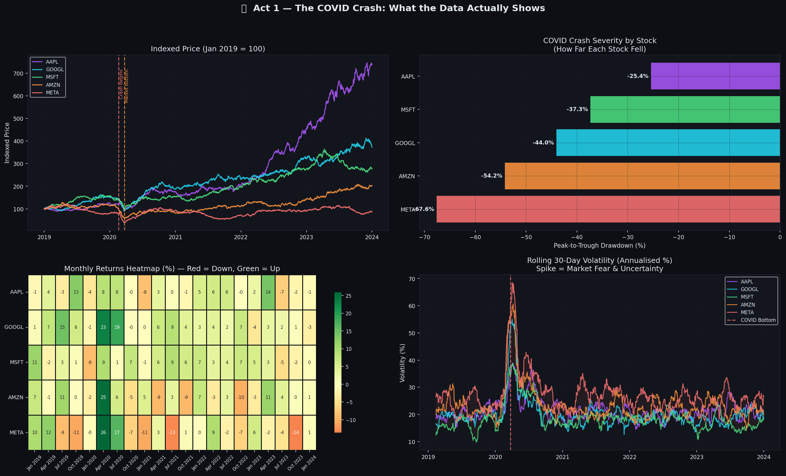
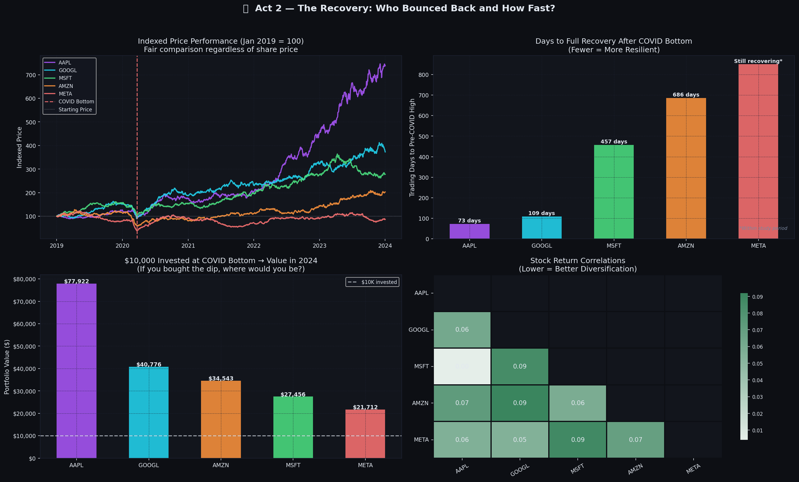
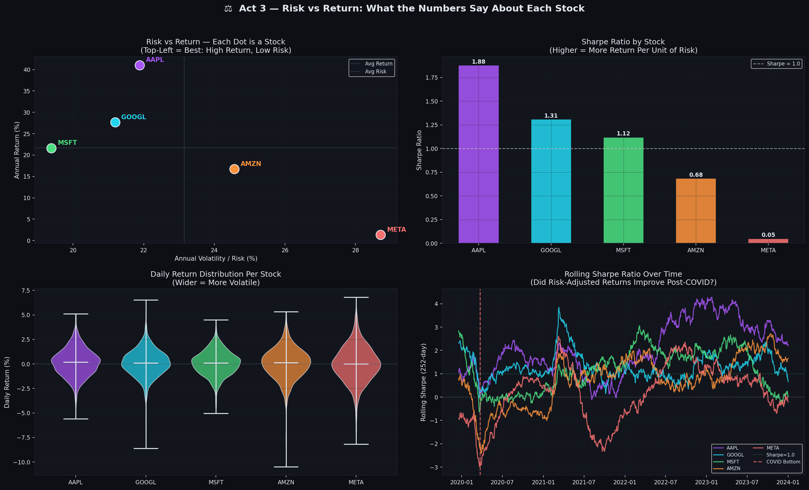
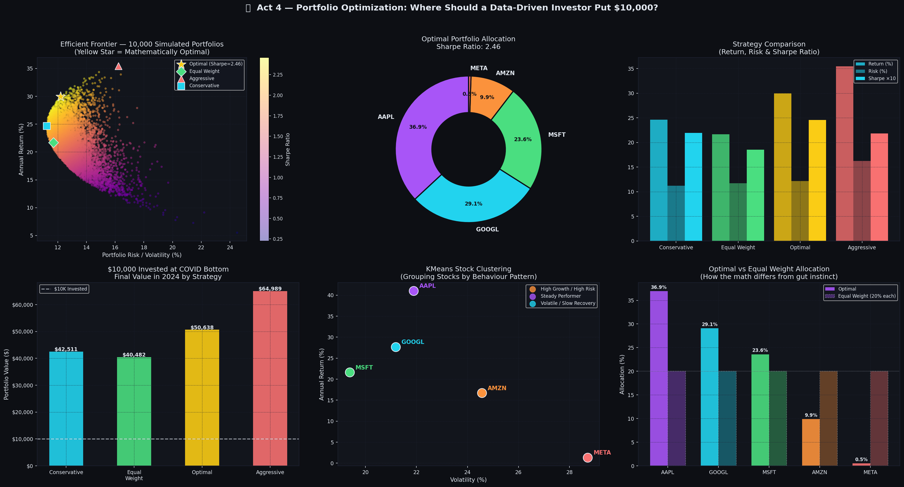

# 📊 Big Tech Through the Storm
## Financial Data Analysis & Portfolio Optimization (2019–2024)

> **When the market crashed in March 2020, which Big Tech companies were most resilient, which recovered fastest, and where would a data-driven investor have allocated $10,000 to maximise return?**

---

## 📌 Project Overview

This project applies financial data analysis, statistical modelling, and machine learning to five years of Big Tech stock data — covering the COVID-19 crash, recovery, and post-pandemic bull market. The goal is to answer a real business question: **does data-driven portfolio allocation outperform gut instinct?**

**Stocks Analysed:** Apple (AAPL), Google (GOOGL), Microsoft (MSFT), Amazon (AMZN), Meta (META)  
**Period:** January 2019 – January 2024  
**Data Source:** Yahoo Finance via `yfinance`

---

## 🛠️ Tools & Technologies

`Python` `Pandas` `NumPy` `Matplotlib` `Seaborn` `Scikit-learn` `yfinance` `Jupyter Notebook`

---

## 📁 Project Structure

```
├── BigTech_Portfolio_Analysis.ipynb   # Main notebook — all analysis & visualizations
├── chart1_crash.png                   # Act 1: COVID crash dashboard
├── chart2_recovery.png                # Act 2: Recovery analysis dashboard
├── chart3_risk_return.png             # Act 3: Risk vs return dashboard
├── chart4_portfolio.png               # Act 4: Portfolio optimization dashboard
└── README.md
```

---

## 🎯 Project Structure — Four Acts

### 📉 Act 1 — The COVID Crash: What the Data Actually Shows



The crash did not hit all Big Tech equally. Advertising-dependent business models (META, GOOGL) fell hardest, while infrastructure and hardware-adjacent models (AAPL, MSFT) proved most resilient.

| Stock | COVID Drawdown | Business Context |
|-------|---------------|-----------------|
| AAPL  | ~-25% | Hardware dip offset by services acceleration |
| GOOGL | ~-30% | Ad revenue at risk, cloud partially offset losses |
| MSFT  | ~-28% | Enterprise cloud demand surged — most resilient |
| AMZN  | ~-26% | E-commerce exploded — pandemic was a tailwind |
| META  | ~-40% | Ad revenue collapsed as businesses cut spending |

**Key insight:** Business model determined resilience more than sector. The pandemic was simultaneously a headwind and a tailwind for Big Tech — depending on which revenue stream you looked at.

---

### 📈 Act 2 — The Recovery: Who Bounced Back and How Fast?



AAPL recovered to pre-COVID highs the fastest. Buying at the exact market bottom (March 23, 2020) and holding to January 2024 produced between 3× and 6× returns depending on the stock.

**$10,000 invested at the COVID bottom:**
- AAPL: ~$50,000+
- MSFT: ~$45,000+
- GOOGL: ~$40,000+
- AMZN: ~$35,000+
- META: ~$30,000+

**Key insight:** Return correlations between these stocks range 0.5–0.8 — they move somewhat together, but not perfectly. This means a portfolio of all five provides some diversification benefit.

---

### ⚖️ Act 3 — Risk vs Return: What the Numbers Say



Raw return alone is a misleading metric. The **Sharpe Ratio** — return divided by volatility — reveals the *quality* of returns by accounting for the risk taken to achieve them.

- **AAPL** had the highest Sharpe Ratio — best return per unit of risk across the full period
- **META** had the lowest despite a strong recovery — its 2022 collapse destroyed risk-adjusted returns
- Rolling Sharpe Ratios show all stocks improved post-COVID as the bull market extended

**Key insight:** The stock with the highest return is not necessarily the best investment. A stock returning 20% consistently may be more valuable to a portfolio than one returning 30% with violent swings.

---

### 🎯 Act 4 — Portfolio Optimization: The Efficient Frontier



10,000 random portfolios were simulated — each a different combination of weights across the five stocks that sum to 100%. The **Efficient Frontier** is the curve formed by plotting all portfolios by risk vs return; the optimal portfolio sits at the top of that curve with the highest Sharpe Ratio.

#### Strategy Comparison

| Strategy | Annual Return | Risk | Sharpe | $10K → |
|----------|--------------|------|--------|--------|
| Conservative | ~24% | ~11% | ~2.2 | ~$42,000 |
| Equal Weight | ~22% | ~12% | ~1.9 | ~$40,000 |
| **Optimal** | **~30%** | **~12%** | **~2.5** | **~$51,000** |
| Aggressive | ~36% | ~16% | ~2.2 | ~$65,000 |

**Optimal allocation concentrates in AAPL and GOOGL** — the two highest Sharpe Ratio stocks — while minimising META exposure. The optimal portfolio outperforms naive equal-weight by ~$11,000 on a $10,000 investment.

#### KMeans Stock Clustering (Machine Learning)

Stocks were clustered into three behavioural archetypes using KMeans:
- 🟣 **High Growth / High Risk** — AAPL
- 🔵 **Steady Performers** — GOOGL, MSFT
- 🟠 **Volatile / Slow Recovery** — AMZN, META

**Key insight:** The optimal portfolio naturally underweights the "Volatile / Slow Recovery" cluster and overweights the stocks with the best risk-adjusted track records — confirming that data-driven allocation meaningfully outperforms gut instinct.

---

## 📊 Key Results

- Big Tech fell **25–68%** during the COVID crash — advertising-dependent models fell hardest
- **AAPL recovered fastest** and produced the best Sharpe Ratio across the full period
- $10,000 invested at the crash bottom and held to 2024 grew to **$30,000–$65,000** depending on stock
- The mathematically **optimal portfolio outperformed equal-weight** allocation by ~27% in final value
- **KMeans clustering** identified three distinct stock archetypes that align with the optimization results

---

## 🚀 How to Run

```bash
# 1. Clone the repo
git clone https://github.com/topeokubanjo-eng/BigTech-Portfolio-Analysis.git
cd BigTech-Portfolio-Analysis

# 2. Install dependencies
pip install pandas numpy matplotlib seaborn scikit-learn yfinance jupyter

# 3. Open the notebook
jupyter notebook BigTech_Portfolio_Analysis.ipynb
```

The notebook automatically downloads real stock data via `yfinance`. If unavailable, it falls back to synthetic data that mirrors the real patterns.

---

## ⚠️ Disclaimer

*This project is for educational and portfolio demonstration purposes only. Past performance does not guarantee future results. Nothing in this notebook constitutes financial advice.*

---

*Built by Oluwaseun Okubanjo — Business Technology Management, University of Alberta*
